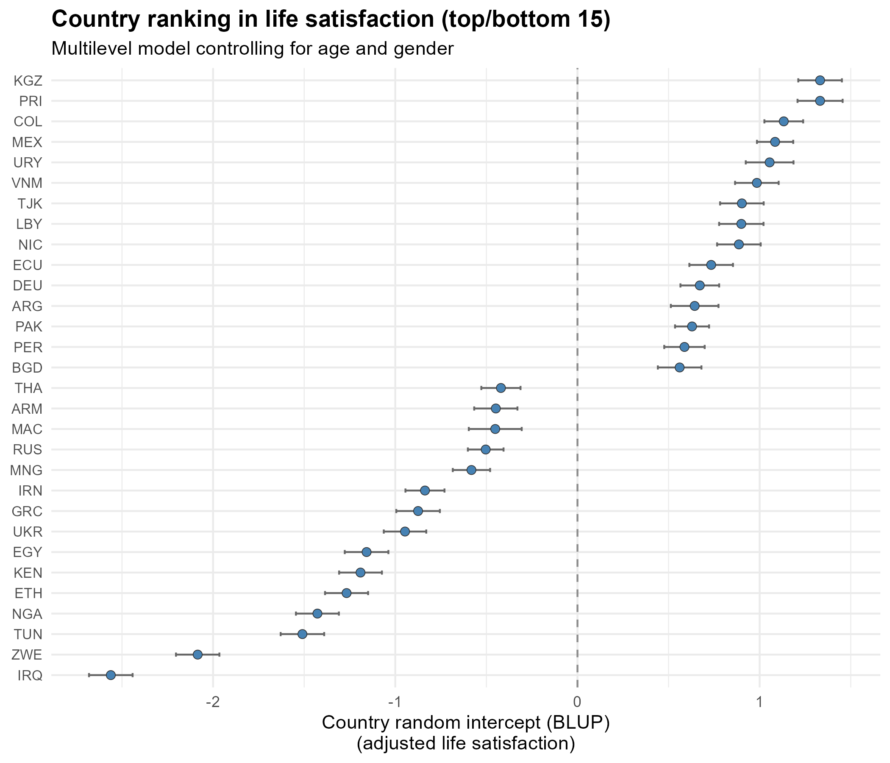
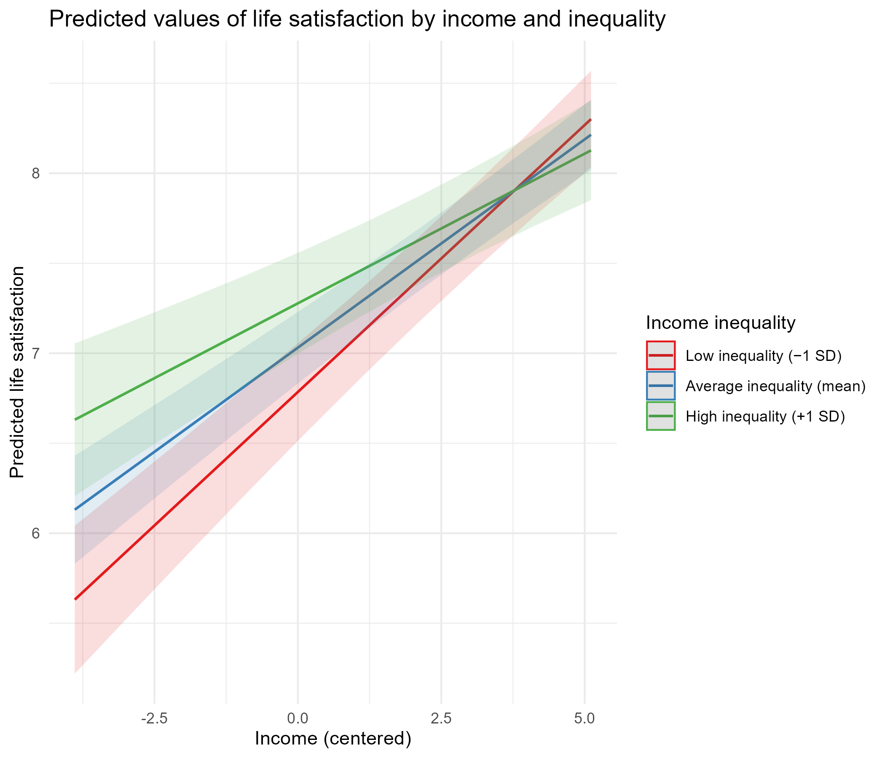

```{r setup, include=FALSE}
knitr::opts_chunk$set(echo = FALSE, message = FALSE, warning = FALSE)
```

```{r}
library(dplyr)
library(tibble)
library(knitr)
library(stringr)
```


## 1. World Values Survey (WVS)

The aim of this study is to examine several dimensions associated with individuals’ life satisfaction. The analysis draws on data from the World Values Survey (WVS), an international research program devoted to the comparative study of social, political, economic, religious, and cultural values across societies. Originating from the European Values Study, the WVS was launched in 1981 by political scientist Ronald Inglehart and has since expanded to cover more than 120 societies worldwide [@wvs2022].

The analysis focuses on individual-level respondents interviewed during the seventh wave of the survey. As in previous waves, Wave 7 includes a diverse set of countries spanning different world regions and levels of economic development. The data have a hierarchical structure, with individuals nested within regions and regions nested within countries, which motivates the use of multilevel modeling techniques.

The outcome variable is life satisfaction, measured on a ten-point scale ranging from 1 (“completely dissatisfied”) to 10 (“completely satisfied”). Life satisfaction is a widely used indicator of subjective well-being in the social sciences, as it captures individuals’ overall evaluation of their lives and has been shown to be systematically related to a broad range of social, economic, and institutional factors[@diener1984]. As life satisfaction varies not only across individuals but also across broader social contexts, this project exploits the clustered structure of the data to assess whether variation in life satisfaction is greater across countries or across regions.

## 2. Data cleaning and preprocessing strategy

Before proceeding to model estimation, a systematic data cleaning and preparation strategy was implemented. All preprocessing steps are fully documented in the script `00_setup.R`, located in the project’s Scripts folder.

The original dataset contains 97,220 observations and 613 variables. To address the research questions of this study, the dataset was subsetted by retaining only variables required for the analyses. Table 1 summarises the variables included in the analysis, their measurement, and their level of aggregation.

```{r tbl: Table_1, tbl.cap = "Variables used in this analysis" }
variables_table <- tibble(
  Variable = c(
    "Life satisfaction",
    "Age",
    "Gender (female)",
    "Household income",
    "Country (numeric code)",
    "Country (ISO code)",
    "Region",
    "Income inequality (Gini)"
  ),
  Description = c(
    "Overall life satisfaction",
    "Respondent's age in years",
    "Dummy variable: 1 = female, 0 = male",
    "Household income decile",
    "Numeric country identifier used for modeling",
    "ISO country code used for labeling and presentation",
    "Region of residence (within country)",
    "Country-level income inequality"
  ),
  Scale = c(
    "1–10 (higher = more satisfied)",
    "Years",
    "Binary (0/1)",
    "Deciles (1–10)",
    "Numeric identifier",
    "ISO alpha code",
    "Region identifier",
    "Continuous index"
  ),
  Level = c(
    "Individual",
    "Individual",
    "Individual",
    "Individual",
    "Country",
    "Country",
    "Region",
    "Country"
  )
)

kable(
  variables_table,
  caption = "Variable definitions and levels of measurement",
  align = "l"
)
```
Life satisfaction is the dependent variable, measured on a ten-point scale as described above. At the individual level, age is measured in years and gender is included as a binary indicator, with men as the reference category. Household income is measured using self-reported income deciles, ranging from 1 (lowest) to 10 (highest).

At the contextual level, income inequality is measured using the Gini coefficient obtained from the World Bank, which ranges from 0 to 100, with higher values indicating greater inequality. Countries are identified using the ISO 3166-1 numeric country code, which is employed for model estimation, and the ISO 3166-1 alpha-3 country code, which is used for labeling and presentation. Regions are identified using the ISO 3166-2 regional classification.

Observations with missing, invalid, or implausible values were excluded. In particular, life satisfaction values outside the 1–10 range and respondents younger than 16 or older than 100 years were removed. To ensure a properly nested hierarchical structure, regional identifiers were constructed by combining country and region codes so that regions sharing the same numeric code across different countries were treated as distinct units. For example, the region Escut d’Andorra la Vella, belonging to Andorra, was originally coded solely as 20007. After constructing the composite identifier, this region is uniquely identified as AND–20007, ensuring that it is associated with its country and preventing regions from being inadvertently pooled across national boundaries. Observations without a valid country–region correspondence were excluded from the analysis.

Given the different modeling objectives of this project, two analysis samples were constructed following data cleaning. A base sample was used for the variance decomposition and the random intercept models and includes all respondents with valid information on life satisfaction, age, gender, and country and region identifiers. For the random coefficient models, an income sample was derived from the base sample by further restricting the data to respondents with valid household income deciles and non-missing country-level Gini coefficients.

The base sample consists of 93,685 observations and 12 variables, while the income sample contains 74,822 observations and 14 variables. This separation ensures that the initial models are estimated on the broadest possible sample and are not driven by additional restrictions required only for the income-related analyses.

Continuous predictors were grand-mean centered to facilitate interpretation of model intercepts and interaction terms. Formally, centering was performed as:

$$
X_c = X - \overline{X}
$$

where $X$ denotes the original predictor and $\overline{X}$ its sample mean. Under this transformation, a value of zero corresponds to the average level of the predictor in the sample. Household income, the Gini coefficient, and age were grand-mean centered. Age was included both linearly and quadratically to allow for potential non-linear associations with life satisfaction (Section 3).

As a final diagnostic step, key descriptive characteristics were compared across the original dataset, the base sample, and the income sample to assess whether restricting the data to complete information on income and income inequality introduced sample selection bias. The three samples display very similar distributions in terms of mean life satisfaction, age, and gender composition, suggesting that the exclusion of observations with missing income or Gini values is unlikely to have substantially altered the composition of the sample.

```{r tbl2: Table_2, tbl.cap = "sample composition across data cleaning stages"}
diagnostic_table <- readRDS("Data/diagnostic_table.rds")
kable(
  diagnostic_table,
  digits = 2,
  caption = "Sample composition across data cleaning stages",
  align = "l"
)
```

## 3. Decomposition of variance in life satisfaction: Null Model

To examine how variation in life satisfaction is distributed across different levels of analysis, an empty three-level linear multilevel model was estimated. The model can be written as:

$$
y_{irc} = \beta_0 + u_{0c} + u_{0rc} + e_{irc}
$$
where $y_{irc}~$ denotes the life satisfaction of individual $i$ residing in region $r$ within country $c$. The term $\beta_0$ represents the global intercept, corresponding to the overall average level of life satisfaction. The random effect $u_{0c}$ captures country-specific deviations from this global mean, while $u_{0rc}$ captures region-specific deviations within countries. Finally, $e_{irc}$, denotes the individual-level error term. 

This model includes no explanatory variables and decomposes the total variance in life satisfaction into three components: variance between countries, variance between regions within countries, and variance at the individual level. Individuals are nested within regions, which are in turn nested within countries. Table 3 reports the estimated variance components from the three-level null model:

```{r tbl3: Table_3,tbl.cap = "Variance decomposition from the three-level null model"}
variance_table_null <- readRDS("Outputs/variance_table_null.rds")

kable(
  variance_table_null,
  digits = 3,
  caption = "Variance decomposition from the three-level null model",
  align = "l"
)
```

To summarise how variance in life satisfaction is distributed across the data hierarchy, variance partition coefficients (VPCs) are reported. The VPC is defined as the proportion of the total variance attributable to a given level of the model. While intraclass correlation coefficients (ICCs) are typically used in two-level models, VPCs are more appropriate in three-level models, as they allow variance to be partitioned across multiple clustering levels.

In this model, the total variance can be expressed as the sum of the variance components at each level:

$$
\sigma^2_{total} = \sigma^2_{country} + \sigma^2_{region} + \sigma^2_{individual}
$$
Accordingly, the VPCs at the country and regional levels are given by:

$$
\begin{aligned}
VPC_{country} = \frac{\sigma^2_{country}}{\sigma^2_{total}}  \\
VPC_{region} = \frac{\sigma^2_{region}} {\sigma^2_{total}}
\end{aligned}
$$

The results indicate that approximately 11.8% of the total variance in life satisfaction is attributable to differences between countries, while 4.0% is attributable to differences between regions within countries, with the remaining variance located at the individual level (Table 3).

Overall, these findings suggest that national-level contexts play a more important role than subnational regional contexts in structuring variation in life satisfaction, although regional differences remain non-negligible. This provides a clear justification for the use of a three-level multilevel modeling framework in the subsequent analyses. 

## 4. Random Intercept Models

To examine whether age and gender are associated with life satisfaction, a series of random-intercept multilevel models were estimated, with individuals nested within countries. Allowing the intercept to vary across countries captures systematic cross-national differences in average life satisfaction while assuming that the effects of individual-level predictors are constant across countries.

First, a model including age (grand-mean centered) and gender (female, with men as the reference category) was estimated. The model can be expressed as: 

$$
y_{ic} = \beta_0 + \beta_{age} + \beta_{female} + u_{0c} + e_{ic}
$$
where $y_{ic}~$ denotes the life satisfaction of individual $i$ residing in country $c$. The term $\beta_0$ represents the global intercept,corresponding to the expected level of life satisfaction for an individual with average age (since age is grand-mean centered), belonging to the reference category for gender (men), and living in an average country.The coefficient $\beta_{age}$ captures the effect of age on life satisfaction, while the term $\beta_{female}$ measures the average difference in life satisfaction between women and men. The random effect $u_{0c}$ captures country-specific deviations from this global mean. Finally, $e_{irc}$ denotes the error term again. The results of the estimated model are presented in Table 4:

```{r tbl4, tbl.cap "Coefficients on linear age model"}

coef_table_age <- readRDS("Outputs/coef_table_age.rds")

knitr::kable(
  coef_table_age,
  digits = 3,
  caption = "Fixed-effects estimates from random-intercept model"
)
```
In the random-intercept model, age is not significantly associated with life satisfaction, while women report slightly higher levels of life satisfaction than men, although the estimated gender effect is small and only marginally significant. We now compare these results to a specification that allows for a non-linear relationship between age and life satisfaction by including a quadratic age term. The model with the quadratic age term can be written as follows:

$$
y_{ic} = \beta_0 + \beta_{age} + \beta_{age^2} + \beta_{female} + u_{0c} + e_{ic}
$$
where the parameters are interpreted as in the previous model, with the addition of $\beta_{age^2}$ which captures the non-linear (quadratic) association between age and life satisfaction. Table 5 reports the results of the model including a quadratic age term:

```{r tbl5, tbl.cap "Fixed-effects estimates from the age-squared model"}

coef_table_age_sq <- readRDS("Outputs/coef_table_age_sq.rds")

knitr::kable(
  coef_table_age_sq,
  digits = 3,
  caption = "Fixed-effects estimates from the age-squared model"
)
```
In the quadratic specification, the linear age term becomes negative ($\hat{\beta}_{age} = -0.00089, t = -1.88$), while the squared term is positive and highly significant ($\hat{\beta}_{age} = 0.00021, t = 8.66$). This pattern suggests a non-linear (U-shaped) association between age and life satisfaction in the sample, with lower levels of satisfaction at midlife and higher levels at younger and older ages. In this preferred model, the gender effect remains positive and slightly stronger ($\hat{\beta}_{female} = 0.028, t = 2.03$).  A likelihood-ratio test comparing the linear and quadratic specifications (estimated using maximum likelihood for fixed-effect comparison) strongly supports the inclusion of the quadratic term ($\chi^2 (1) = 75.00, p < 0.001$). 
Next, the extent to which age and gender explain between-country variation was examined by comparing the estimated country-level variance in the empty country-intercept model and the model including quadratic age and gender. The country-level variance changes only negligibly (from 0.6217 to 0.6201), corresponding to a reduction of approximately 0.26%. This limited reduction is expected, as age and gender are individual-level characteristics and therefore explain little of the variation in average life satisfaction across countries.

Finally, country-specific random intercepts (BLUPs) were extracted from the preferred model (including quadratic age, linear age and gender) in order to rank countries by their adjusted average level of life satisfaction. These random intercepts represent country deviations from the grand mean net of differences in age and gender composition. A table (Appendix Table 1) and a plot (Figure 1) summarize this ranking. Positive BLUPs indicate countries with higher average life satisfaction than expected given their age and gender composition, whereas negative BLUPs indicate lower-than-expected levels. Confidence intervals that exclude zero indicate statistically meaningful deviations from the global mean. For example, Kyrgyzstan (KGZ) and Puerto Rico (PRI) rank among the countries with the highest adjusted life satisfaction, while Zimbabwe (ZWE) and Tunisia (TUN) display the lowest values.

```{r fig1, fig.cap="Country ranking in life satisfaction", out.width= "55%", fig.align="center"}


```

## 5. Random Coefficient Models

To investigate the relationship between income and life satisfaction, a series of multilevel models were estimated using the income subsample. We begin with a random-intercept model in which income is included as a fixed effect, while allowing the intercept to vary across countries. This specification assumes that the association between income and life satisfaction is constant across countries, but that countries differ in their average level of life satisfaction. The results indicate a strong and positive association between income and life satisfaction ($\hat{\beta}_{income} = 0.215$, $t = 57.18$), suggesting that higher household income is associated with substantially higher levels of life satisfaction. The intraclass correlation coefficient indicates that approximately 12.7% of the residual variance in life satisfaction is attributable to between-country differences.

Next, a random-slope model was estimated in which the effect of income was allowed to vary across countries. In this specification, both the intercept and the income slope are modeled as random effects at the country level. The variance of the random income slope is clearly different from zero, indicating meaningful cross-national heterogeneity in the strength of the income–life satisfaction relationship. A likelihood-ratio test comparing the random-intercept model and the random-slope model strongly favors the latter ($\chi^2(2) = 1155.7$, $p < 0.001$), providing clear evidence that the effect of income on life satisfaction varies across countries.

To assess whether this cross-national variation can be explained by differences in income inequality, a country-level measure of inequality (the Gini coefficient) was added to the model, along with a cross-level interaction between income and inequality. The interaction term is negative and statistically significant, indicating that the positive association between income and life satisfaction is weaker in countries with higher income inequality. In other words, increases in household income are less strongly associated with higher life satisfaction in more unequal societies. The model can be written as follows:

$$
y_{ic} = \gamma_{00} + \gamma_{01} gini_c + \gamma_{10} income_{ic}
+ \gamma_{11} (income_{ic} \times gini_c)
+ \gamma_{2} age_{ic} + \gamma_{3} age^2_{ic} + \gamma_{4} female_{ic}
+ u_{0c} + u_{1c} income_{ic} + e_{ic}
$$
where $y_{ic}$ denotes the life satisfaction of individual $i$ residing in country $c$. The term $\gamma_{00}$ represents the global intercept, corresponding to the expected level of life satisfaction for an individual with average income and age, belonging to the reference gender category (men), and living in a country with average income inequality. The coefficient $\gamma_{10}$ captures the average association between income and life satisfaction, while $\gamma_{01}$ measures the association between income inequality and life satisfaction. The interaction term $\gamma_{11}$ indicates how the effect of income on life satisfaction varies with income inequality. The coefficients $\gamma_{2}$ and $\gamma_{3}$ capture the linear and quadratic effects of age, and $\gamma_{4}$ measures gender differences in life satisfaction. Random effects  $u_{0c}$ and $u_{1c}$ allow the intercept and income slope to vary across countries, and $e_{ic}$ denotes the individual-level error term. Table 6 reports the results of this model:

```{r tbl6, tbl.cap ""}

coef_table_income_gini <- readRDS("Outputs/coef_table_income_gini.rds")

knitr::kable(
  coef_table_income_gini,
  digits = 3,
  caption = "Fixed-effects estimates from random-slope model with income–inequality interaction"
)
```

The results show a strong positive association between household income and life satisfaction, alongside a statistically significant negative interaction with income inequality, indicating that the positive effect of income on life satisfaction is weaker in more unequal countries. A likelihood-ratio test comparing the random-slope model with and without the Gini interaction confirms that the inclusion of income inequality significantly improves model fit ($\chi^2(2) = 12.05$, $p = 0.002$). This suggests that cross-national differences in income inequality partly account for the observed variation in the income–life satisfaction relationship across countries.

To illustrate this moderating effect, predicted values from the interaction model are plotted for low, average, and high levels of income inequality. The figure 2 shows that while life satisfaction increases with income in all contexts, the slope of this relationship is noticeably flatter in countries with higher inequality, consistent with the negative interaction effect observed in the regression results.

```{r fig2, fig.cap="Predicted Values Gini-income interaction model", out.width= "55%", fig.align="center"}


```

## 6. Appendix

```{r tbl6}
country_ranking_table <- readRDS("Outputs/country_ranking_table.rds")

pretty_table <- country_ranking_table %>%
  # Keep only valid ISO-3 country codes (e.g., "FRA", "ESP", "DEU")
  filter(!is.na(country_iso), str_detect(country_iso, "^[A-Z]{3}$")) %>%
  # Select and rename columns for presentation
  transmute(
    country_iso = country_iso,
    blup = intercept,
    low_confidence_interval  = ci_low,
    high_confidence_interval = ci_high
  ) %>%
  arrange(desc(blup))

kable(
  pretty_table,
  digits = 3,
  col.names = c("Country (ISO)", "BLUP", "Low confidence interval", "High confidence interval"),
  caption = "Country ranking in life satisfaction (controlling for age and gender)"
)

```
## 7. References

